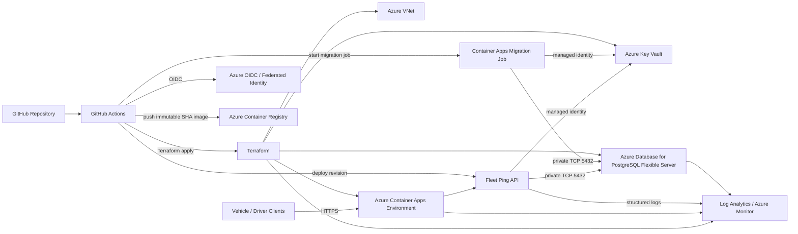

# Architecture

## Network boundaries

- Public: HTTPS API ingress only.
- Private: PostgreSQL and internal infrastructure.
- Identity: managed identities rather than application-held Azure credentials.
- CI/CD: GitHub OIDC with no long-lived Azure secret.
